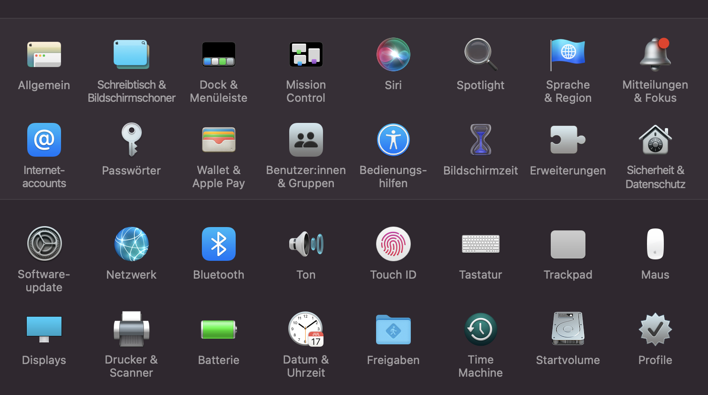
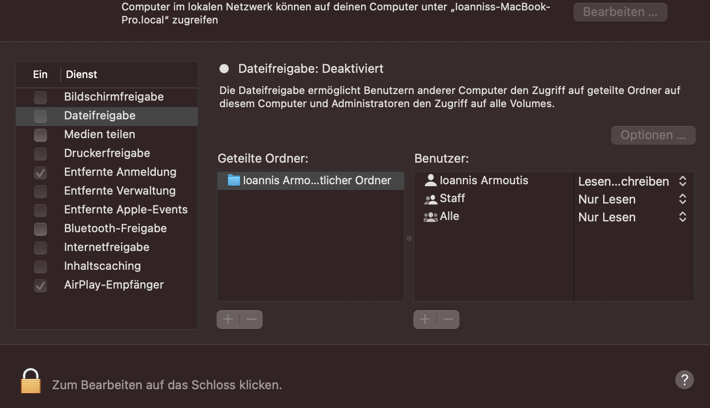
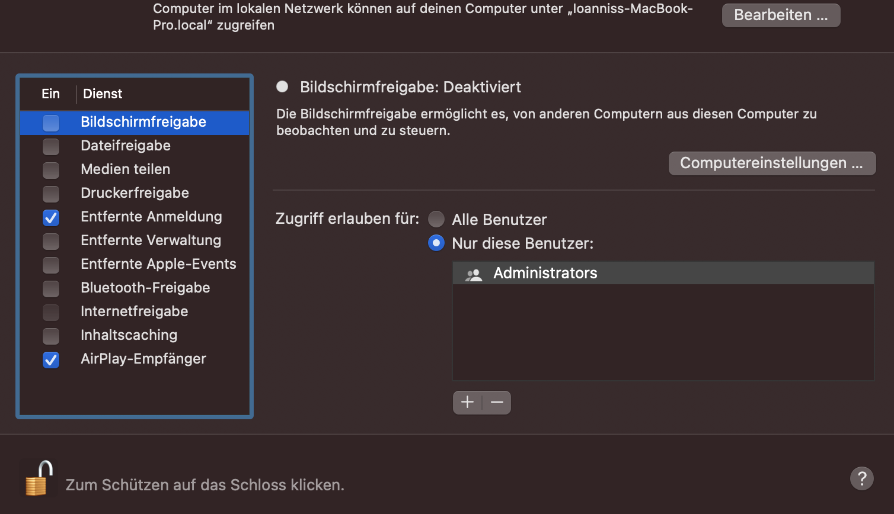
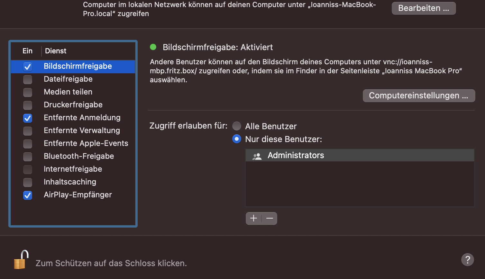

VNC on Linux/MacOS/Windows (with Putty) 
********

Download VNC Viewer to the device you want to control.

Make sure you have downloaded VNC® Connect to the computer you want to control.

Download VNC Viewer and VNC Connect, for Linux/MacOS/Windows,  and more ...

https://www.realvnc.com/de/connect/download/viewer/macos/

VNC on MacOS
*********

    
    Finde in der Menueleiste die Systemeinstellungen 
    

    
    Finde in den Systemeinstellungen die Freigaben 
    

    
    Finde in den Freigaben die entfernte Anmeldung 
    

    
    Gebe dein Passwort von deinem Benutzer ein und schalte den Zugang auf entferne Geraete sowohl bei dir als auch bei anderen System per ssh frei
    

    
    Jetzt muesste es moeglich sein vnc Viewer & Connect zu nutzen! 

.. figure:: ./dokumentation_ipsy/bilder_vnc/controlled.png
    :name: controlled.png
    :alt:  controlled.png
    :align: center
    :width: 20%

 Test to controll !
 
.. figure:: ./dokumentation_ipsy/bilder_vnc/becontrolled.png
    :name: becontrolled.png
    :alt: becontrolled.png
    :align: center
    :width: 20%

Test to be controlled !

VNC on Linux
****
Text 

VNC on Windows
**********

Putty on Windows/Linux/MacOS
**********
All pages and steps found detailed here: 

https://www.ssh.com/academy/ssh/putty/windows

And short here: 

Putty on Windows
**********

Download Putty. 
https://www.chiark.greenend.org.uk/~sgtatham/putty/latest.html

Putty on Linux
**********

Putty on MacOS
**********

Config & Settings 
******
Killen von Prozessen auf dem Server Medusa 

.. code::
ps aux | grep Benutzer | grep vnc
vncserver -kill :9
pkill -u Benutzer

----

Important to know: 
links for more understanding: 
